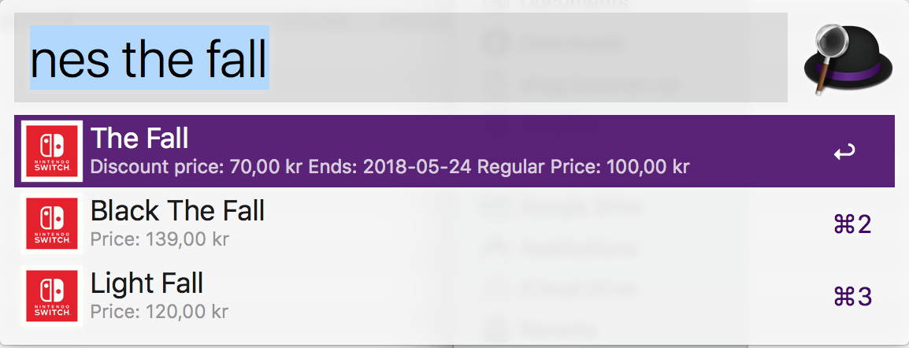

# Nintendo Europe Search
Alfred 3 plugin to search the Nintendo Europe (including South Africa) region for Switch games and display regular and discounted prices.

# Download

[Download the latest relase from GitHub](https://github.com/larkov/alfred-nes-workflow/releases/latest).

## Usage
After installation use the keyword "nes" followed by the game title you are interested in.

When pressing enter on a search result you will be taken to the game web site.

By default it displays three search results and prices in £ and links to the uk web site.

You can change number of results by changing the rows variable and you can change the country code variable to:
- AT = Österreich
- BE = België
- CH = Schweiz
- DE = Deutschland
- DK = Danmark (opens site in English)
- ES = España
- FR = France
- FI = Suomi (opens site in English)
- GB = Great Brittain and Ireland (default)
- IT = Italia
- NL = Nederland
- NO = Norge (opens site in English)
- PT = Portugal
- RU = Россия
- SE = Sverige (opens site in English)
- ZA = South Africa

## Screenshot

## Disclaimer
This plugin is in no way affiliated with Nintendo.